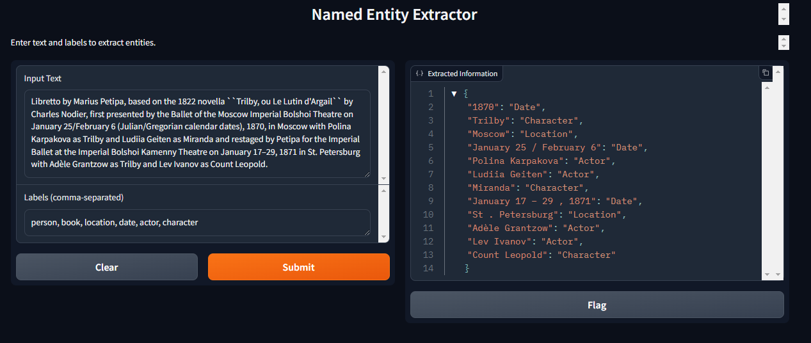

# End-to-end Zero-shot Named Entity Recognizer

A comprehensive Named Entity Recognition (NER) system.


## Prerequisite for installation and local web deployment
For successful local web deployment, ensure your machine is equipped with both conda and Docker.
### Installation summary for deployment


- `conda create -n deploy python=3.9` creates a conda virtual environment
- `conda activate deploy` activates the virtual environment
- `requirements/prod.in` and `requirements/dev.in` specify core Python packages in that environment
- `make pip-tools-prod` resolves all other Python dependencies and installs them
- `export PYTHONPATH="$(pwd):$PYTHONPATH"` makes the current directory visible on your Python path -- add it to your `~/.bashrc` and `source ~/.bashrc`

### 1. Check out the repo

```
git clone https://github.com/hoangvu971/NER-project
cd NER-project
```

### 2. Set up the Python environment

We use
[`conda`](https://docs.conda.io/en/latest/miniconda.html)
for managing Pythonversions, and for managing Python package dependencies.

We add a `Makefile` for making setup dead-simple.

Run `conda create -n deploy python=3.9` to create an environment called `deploy`.
```sh
conda create -n deploy python=3.9
```

Next, activate the conda environment.

```sh
conda activate deploy
```
#### Next: install Python packages

Next, install all necessary Python packages by running 
```sh
make pip-tools-prod
```

#### Set PYTHONPATH

Last, run `export PYTHONPATH="$(pwd):$PYTHONPATH"` before executing any commands later on, or you will get errors like this:
```python
ModuleNotFoundError: No module named 'src'
```

In order to not have to set `PYTHONPATH` in every terminal you open, just add that line as the last line of the `~/.bashrc` file using a text editor of your choice (e.g. `nano ~/.bashrc`) or by concatenating with `>>`
```bash
echo "export PYTHONPATH="$(pwd):$PYTHONPATH"" >> ~/.bashrc
```

### 3. Import model and convert it to ONNX format
The Python script `import_and_convert_model.py` imports a Hugging Face model and converts it to the ONNX format, enabling easier deployment and integration with various deep learning frameworks.
```sh
python training/import_and_convert_model.py
```
## Local web deployment
Navigate to the `model_serving` folder
```bash
cd model_serving
```

Build and start a Docker container and maps the container's port 3000 to the host's port 3000
```bash
docker-compose up --build
```

Navigate back to the project's root, then go to `app_gradio` folder

```bash
cd app_gradio
```

Start the Gradio app locally

```bash
python app.py
```

Now you can go to the provided local URL in your terminal on your browser to try out the Gradio app.

